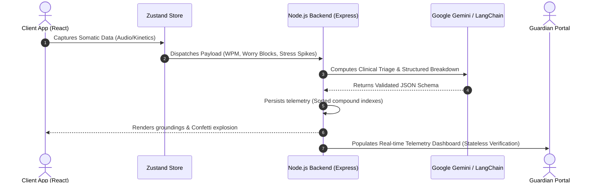

# AuraOS

<div align="center">


[](https://react.dev/)
[](https://nodejs.org/)
[](https://www.mongodb.com/)
[](https://deepmind.google/technologies/gemini/)
[](LICENSE)
[](#)

<h3>The Biology-First Somatic Operating Layer for Proactive Mental Resilience.</h3>

*AuraOS is an open-source, Zero-UI somatic operating layer designed to bypass the cognitive barriers of traditional mental health trackers by mapping real-time biological state indicators (vocal cadence, kinetic stress, and executive paralysis) directly to frictionless micro-interventions. By shifting from reflective journaling to active, real-time physiological offloading, AuraOS catches users at their lowest capacity state to build durable psychological safety nets.*

---

[View API Contracts](docs/API_CONTRACTS.md) · [System Architecture](docs/structure.md)

</div>

## 1. The "Systemic Breakage" (Why We Built This)

Traditional mental health applications suffer from the **"Participation Paradox"**: they demand maximum active cognitive effort (such as typing structured journals, filling out long diagnostic forms, or navigating complex submenus) during acute panic attacks, sensory overloads, or ADHD freezes when a user's executive function capacity is at absolute zero. These apps function as passive, retrospective logs rather than active somatic safety nets.

Furthermore, a significant **"Context Gap"** exists between when a crisis occurs and when it is documented. Retrospective tracking misses the critical physiological window where somatic grounding is effective, leading to poor clinical adherence and diagnostic blindspots.

AuraOS breaks this loop by separating *interaction* from *reflection*:

| Interaction Vector | Traditional Passive Trackers | AuraOS Active Interventions |
| :--- | :--- | :--- |
| **Cognitive Load** | High. Requires structured semantic entry and manual data input. | **Zero-UI.** Adapts to voice velocity and erratic mouse/touch kinetics. |
| **Timing & State** | Retrospective. Captures logs hours after the crisis has passed. | **Real-Time.** Intervenes immediately during acute physiological spikes. |
| **User State Adherence** | Near-zero during panic freezes or executive dysfunction. | **High.** Frictionless physics and micro-tasks act as immediate somatic releases. |
| **Observer Integration** | Isolated. No automated escalation to physical guardians. | **Proactive.** 3-key verified alerts notify emergency **Guardians** instantly. |

---

## 2. Core Ecosystem & Features

AuraOS integrates B2C somatic tools with a B2B zero-trust enterprise support framework to establish a continuous feedback loop between clients, employees, and wellness committees.

### 2.1 B2C Client Engine

*   🗣️ **Aura Voice (Conversational Emotion AI):** A JS-native speech-to-text velocity and semantic analysis pipeline that calculates average words-per-minute (WPM) and volume dynamics in real time. It routes these metrics and transcript chunks to Google Gemini, adapting grounding response length and tone according to the user's **Critical Escalation Index ($CEI$)**.
*   🧱 **Cognitive Forge (Physics-Based Somatic Offloading):** Turns abstract mental weight into 2D physical bodies in a Matter.js rigid-body physics world. Unstructured worry streams are mapped via Gemini Flash to discrete worry nodes with weighted mass and size. Users physically drag and fling these blocks into a fireplace sensor zone, triggering a particle burst and database synchronization.
*   ⚡ **Task Shatterer (Executive Function Engine):** Overcomes ADHD task paralysis by decomposing intimidating goals into single, 2-minute actionable micro-quests using LangChain's Zod structured outputs. Features a continuous brown noise audio loop to optimize neural focus and a tab visibility tracker that prompts a "Body Double" avatar to re-engage the user if they navigate away for more than 8 seconds.

### 2.2 B2B Enterprise Shield & Guardians

*   🛡️ **Dual-Tier Onboarding:** Segregates public B2C client setups from corporate B2B employee registrations, binding employees to verified cohorts and strict internal schemas.
*   👁️ **Stateless Welfare Portals:** Provides real-time, SWR-secured telemetry dashboards (showing mood indexes and stress alerts) to designated Guardians and Welfare Committees. Operates on a zero-trust model: reviewer sessions are stateless, requiring a valid alphanumeric ID, cohort dropdown validation, and temporary security tokens to prevent session hijacking.

---

## 3. System Architecture (The Monorepo)

AuraOS is structured as a 100% JavaScript monorepo to ensure zero-dependency boundary bloat and keep local network latency minimal:

```
Aura-OS/
├── frontend/                  # React 18 + Vite SPA client
│   ├── src/
│   │   ├── components/        # Interactive canvas, visualizers, and portals
│   │   ├── hooks/             # Matter.js physics managers & Web Audio stream hooks
│   │   ├── store/             # Zustand global state store (flat session schemas)
│   │   └── services/          # Central API gateway wrappers (api.js, authApi.js)
│   └── Dockerfile             # SPA build & Nginx hosting setup
├── backend-node/              # Express orchestration backend
│   ├── src/
│   │   ├── controllers/       # Clinical metrics, auth flow, and RAG handlers
│   │   ├── models/            # Mongoose schemas & database discriminators
│   │   └── services/          # Adapters for LangChain, Gemini, and Twilio
│   ├── server.js              # Server entry point
│   └── Dockerfile             # Node application build script
├── docs/                      # Architectural specs & API contracts
├── docker-compose.yml         # Local container orchestrator
└── package.json               # Root monorepo coordinator
```

### 3.1 Zero-Trust Data Isolation (Mongoose Discriminators)

All telemetry and clinical data are anonymized and bound to a dynamic `userStateId` generated during intake. To enforce clean data isolation without the overhead of multiple databases, the system utilizes **Mongoose Discriminators** (`accountType`) to differentiate `CLIENT`, `EMPLOYEE`, `GUARDIAN`, and `COMMITTEE` document structures within a single unified `User` collection. This prevents cross-role authorization leaks at the schema level:

```javascript
// Schema Discriminator Mapping
export const ClientUserModel = UserModel.discriminator('CLIENT', new Schema({
  guardianId: { type: Schema.Types.ObjectId, ref: 'User', default: null },
  patientIntake: { type: Schema.Types.Mixed, default: null },
  dailyMoodLogs: { type: [MoodLogSchema], default: [] }
}));

export const EmployeeUserModel = UserModel.discriminator('EMPLOYEE', new Schema({
  employeeId: { type: String, required: true, unique: true, sparse: true },
  cohort: { type: String, enum: ['ENGINEERING', 'MARKETING', 'OPERATIONS', 'PRODUCT', 'HR'], required: true }
}));
```

### 3.2 System Sequence Diagram



---

## 4. Local Setup & Installation

Follow these steps to spin up the monorepo locally.

### 4.1 Prerequisites
- **Node.js** v20.x or higher
- **MongoDB** local instance or MongoDB Atlas Connection URI
- **Google Gemini API Key**

### 4.2 Installation

1.  **Clone the repository:**
    ```bash
    git clone https://github.com/Maayank18/Aura-OS.git
    cd Aura-OS
    ```

2.  **Install dependencies across the monorepo:**
    The root `package.json` coordinates child installations:
    ```bash
    npm run install:all
    ```

3.  **Configure Environment Variables:**
    Create a `.env` file in the `backend-node/` directory:
    ```bash
    cp backend-node/.env.example backend-node/.env
    ```
    Populate the following variables:
    ```env
    PORT=5001
    MONGO_URI=mongodb+github_url_or_atlas_path/auraos
    GEMINI_API_KEY=your_gemini_api_key_here
    JWT_SECRET=your_jwt_signing_secret_here
    FRONTEND_URL=http://localhost:5173
    
    # Twilio (Required for live SMS/WhatsApp Guardian Triage Alerts)
    TWILIO_ACCOUNT_SID=your_twilio_sid
    TWILIO_AUTH_TOKEN=your_twilio_auth_token
    TWILIO_PHONE_NUMBER=your_twilio_phone
    ```

4.  **Generate Brown Noise Assets:**
    Compile the ADHD grounding sound wave asset:
    ```bash
    node scripts/generate-brown-noise.mjs
    ```

5.  **Launch the System:**
    Run both frontend and backend concurrently from the root directory:
    ```bash
    npm run dev
    ```
    - **Frontend Client:** [http://localhost:5173](http://localhost:5173)
    - **Backend Node API:** [http://localhost:5001](http://localhost:5001)

---

## 5. Future Scope

*   ⌚ **Galaxy Wearable TinyML Integration:** Compiling lightweight TensorFlow Lite models to run directly on wearable edge processors, parsing skin temperature and heart rate variability (HRV) offsets straight into the local State Store.
*   📸 **Contactless rPPG Web-Camera Tracking:** Extracting pulse wave signals from the user's facial webcam feed (photoplethysmography) to detect autonomic nervous system spikes without physical sensor arrays.
*   🧠 **Predictive Burnout Modeling:** Building temporal recurrent networks to forecast employee burnout risks 72 hours prior to a potential freeze state, alerting welfare committees through privacy-compliant secure channels.